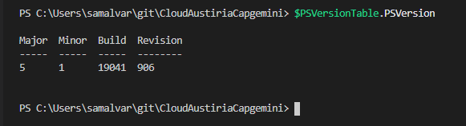
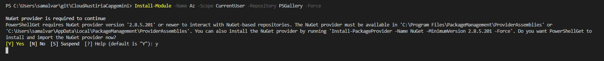
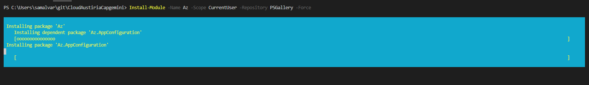

# Laboratorio de Monitorización -  Nagios 
### Objetivo del laboratorio
+ A través de este ejercicio desplegaremos un grupo de recursos y una Máquina virtual en Azure.

### 1.- Instalar Az Powershell (administrador):
Los portatiles de Capgemini ya tienen habilitada la función de PowerShel por lo que podréis acceder a la misma a través del menú de inicio de Windows sin necesidad de instalar Powershell. Si empleáis algun Software como [Visual Studio Code](https://code.visualstudio.com/), del que hablaremos mucho a lo largo de las prácticas, también tiene integrado, en su consola, Powershell.

+ Revisar versión de PowerShell:
 
  ```powershell
    $PSVersionTable.PSVersion
  ```

  El resultado debería ser similar a lo mostrado en la siguiente captura de pantalla. A partir de la versión 3 de PowerShell se puede instalar sin problemas el paquete de Azure Power Shel:

  

+ Instalar el modulo de Azure PowerShell (El proceso de instalación puede demorarse un rato considerable en función de la velocidad de vuestra red):

  ```powershell
    Install-Module -Name Az -Scope CurrentUser -Repository PSGallery -Force
  ```

  

  


